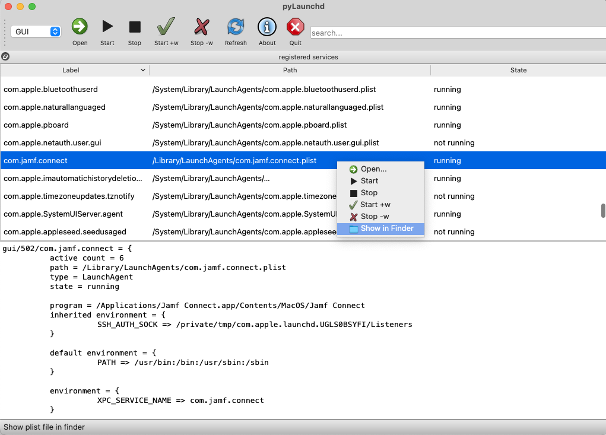

# pylaunchd_app

use  nuitka3 --standalone --onefile --macos-app-version=2.0 --disable-console  --output-dir=build   --enable-plugin=pyqt5 --macos-create-app-bundle  --assume-yes-for-download   --show-progress   --macos-app-name=com.xxxx.pylaunchd_gui --nofollow-imports  --macos-app-icon=1.png pylaunchd_gui.py
to create this app 
only aarch64 mac could use!

# pylaunchd
MacOS launchd/launchctl GUI

- view macos launch agents and daemons under the `user/system/gui` domains and display detailed properties for each service
- start/stop/enable/disable jobs (WIP) 
- edit service launchers with user configurable editor; some `.plist` files are plain text XML's, for binary `.plist` files consider e.g. [TextMate](https://macromates.com/) or [SublimeText](https://www.sublimetext.com/) with [binary plist package](https://packagecontrol.io/packages/BinaryPlist) installed) 




## Dependencies

To run the app the following dependencies are needed (assuming [homebrew](https://brew.sh/) is already installed):

- python3 — normally, already present on modern macos versions, a user-managed version can be installed with `brew install python`
- qt5 - install with `brew install qt5`
- pyqt5 - install with `pip3 install pyqt5`

## Usage 

The program is contained in a single file and can be launched with: 

```bash
python3 pylaunchd_gui.py
```

## `launchd`, `launchctl` documentation

- https://developer.apple.com/library/archive/technotes/tn2083
- `man launchctl`
- `man launchd`
- `man launchd.plist`

### Other launchd GUI apps

- [Lingon X](https://www.peterborgapps.com/lingon/)
- [LaunchControl](https://www.soma-zone.com/LaunchControl/)
